# AppRefiner

AppRefiner is a powerful code analysis and refactoring tool specifically designed for PeopleCode development. It helps developers identify potential issues, optimize code quality, and apply best practices through linting, styling, and automated refactoring.

Additionally it unlocks features such as code folding and improves the formatting of SQL objects during development.

## Features

### Editor Tweaks
- Provides code folding capabilities
- Better edit-time formatting for SQL objects
- Supports annotations for in-line visual feedback
- Dark mode support for code editors
- Tab key will insert 3 spaces, allowing you to align your code without saving.

### Code Analysis
- **Linting**: Automatically detect issues like:
  - Empty catch blocks
  - Nested if-else statements
  - Long expressions
  - SQL wildcard usage
  - Recursive function calls
  - Missing FlowerBox headers
  - And many more

### SQL Validation
- **SQL Binding Validation**: Automatic validation of SQL parameter binding:
  - Validates SQLExec calls have the correct number of bind and output variables
  - Validates CreateSQL/GetSQL statements have proper parameter counts
  - Checks SQL.Execute, SQL.Open, and SQL.Fetch method calls for correct parameter usage
  - Detects string concatenation in SQL statements (potential SQL injection risk)
  - Validates SQL definition references when connected to a database
  - Warns when bind values aren't provided before SQL.Fetch calls
  - Validates array usage for multi-column result sets

### Code Refactoring
- **Automated Refactoring**: Improve your code with:
  - Local variable renaming
  - Import optimization
  - Add proper FlowerBox headers

### Style Analysis
- **Code Styling**: Highlight style issues such as:
  - Meaningless variable names
  - Properties used as variables
  - Unused imports and variables

### Database Integration
- Optionally Connect to Oracle PeopleSoft databases
- Enhances the capabilities of some linting rules 

### Productivity Features
- Global hotkey support for quick access
- Templates for common code patterns
- Dark mode support

## Getting Started

### Prerequisites
- Windows operating system
- .NET 8 

### Installation
1. Clone this repository or download the latest release
2. Build the solution using Visual Studio
3. Run the AppRefiner.exe application

### Basic Usage
1. Launch the application
2. Use the hotkey (configurable) to analyze the code in your current editor
3. Review the reported issues
4. Apply suggested refactorings as needed

### Keyboard Shortcuts
AppRefiner provides seamless keyboard shortcuts that work directly inside Application Designer without needing to switch back to the AppRefiner window:

- **Alt+Left**: Collapse current section
- **Alt+Right**: Expand current section
- **Ctrl+Alt+Left**: Collapse all top-level sections
- **Ctrl+Alt+Right**: Expand all top-level sections
- **Ctrl+Shift+R**: Rename local variable (cursor must be in a variable name or have it highlighted)
- **Ctrl+Alt+L**: Trigger code linting

## Database Connection
For database-related functions:
1. Use the DB Connect dialog
2. Select your Oracle TNS name
3. Provide bootstrap credentials

## Templates
AppRefiner includes several code templates for common patterns:
- GT Grid/form events
- Plain classes

## License
See the [LICENSE](LICENSE) file for details.

## Contributing
Contributions are welcome! Please feel free to submit a Pull Request.

## Screenshots
### Main interface
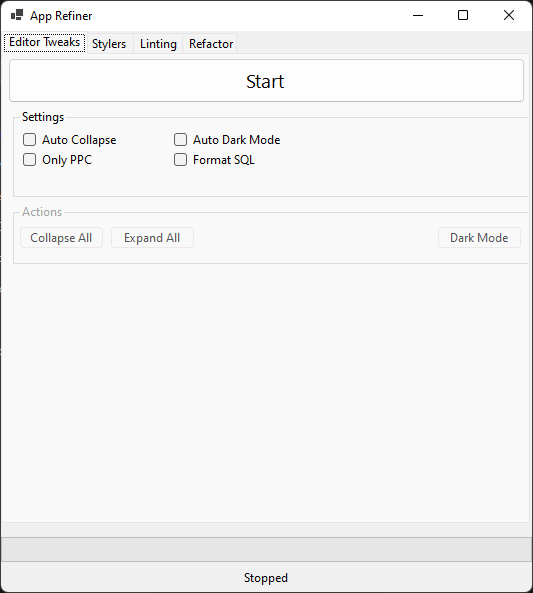
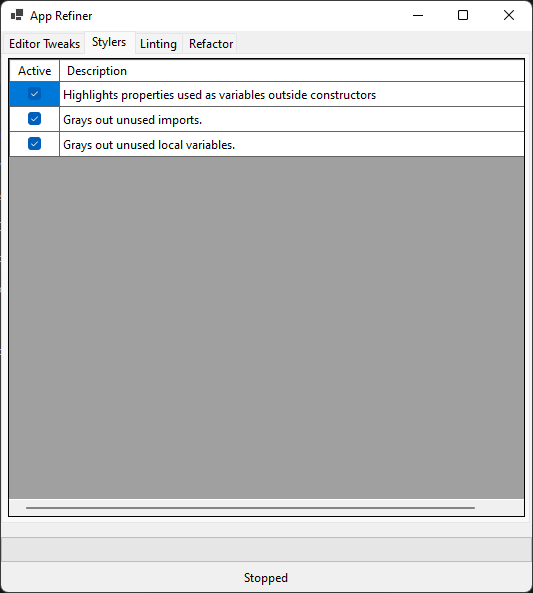
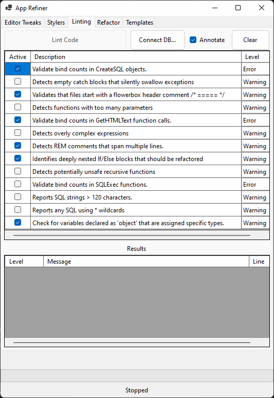

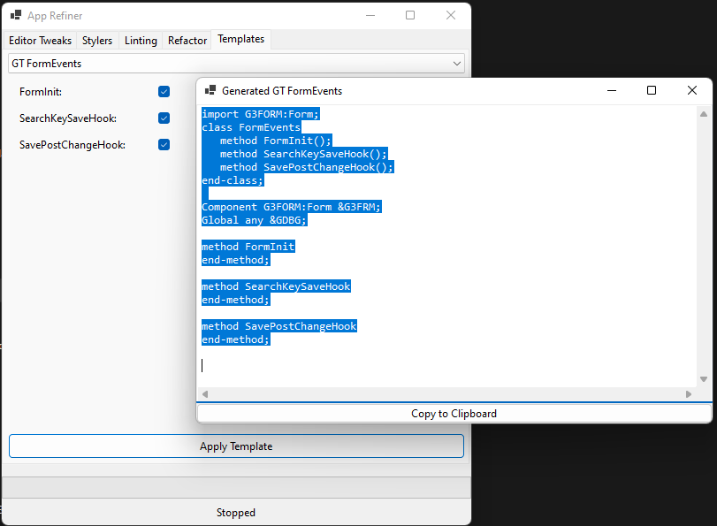

### Editor Tweaks
*Example of PeopleCode with code folding enabled*
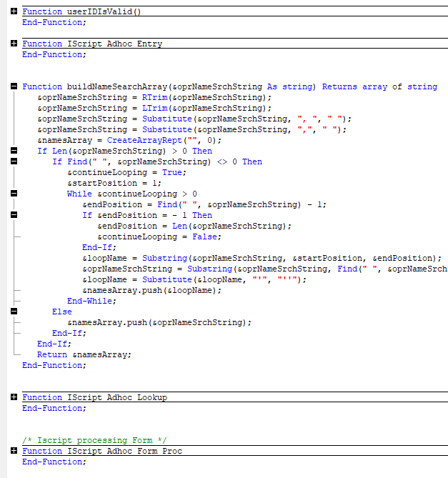

#### Improved SQL formatting in the editor

##### Before 
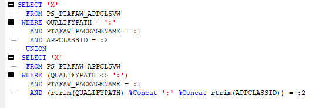

##### After
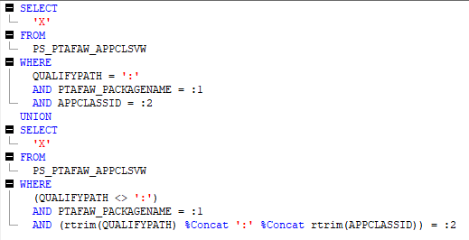

*In-line annotations providing feedback directly in the editor*

### Linters in Action
*Linter identifying potential issues in the code. Clicking on results navigates the editor*
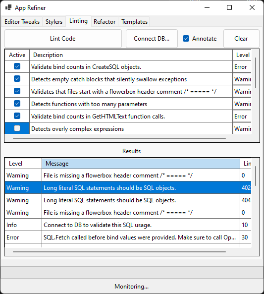

*SQL binding validation in action*
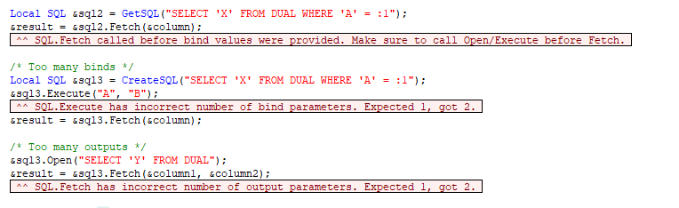

### Stylers
*Shown here is an unused import and a meaningless variable name*

*Shown here is styling of class properties accessed like variables and an unused variable*
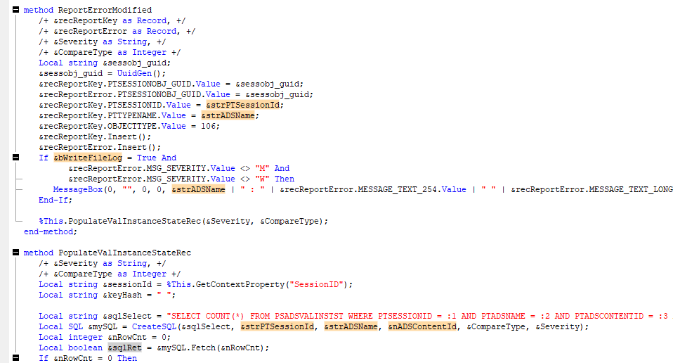

### Database Integration
*Database connection dialog for Oracle PeopleSoft integration*
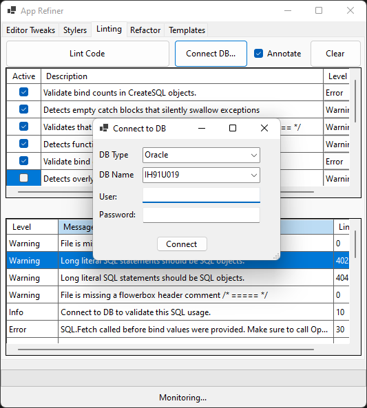

