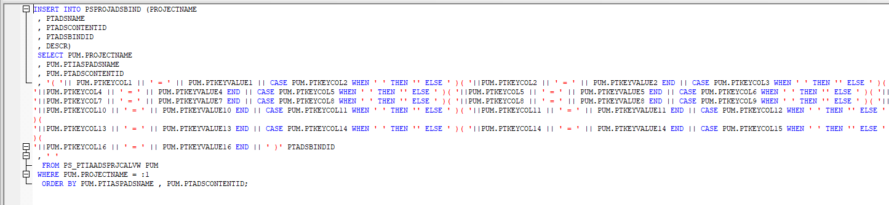
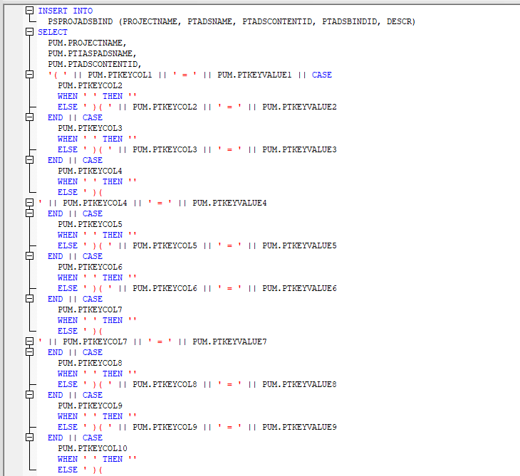

# SQL Formatting

App Refiner provides improved SQL formatting for better readability while editing SQL definitions in Application Designer.

## Overview

Application Designer enforces its own SQL formatting when saving SQL definitions, which is optimized for storage rather than readability. This can make SQL difficult to understand and edit while working with it.

App Refiner detects when a SQL definition is open and automatically reformats it to a more readable format for editing purposes. This reformatting is temporary and only affects the display during editing - it does not change the underlying format that Application Designer enforces when saving.

## How It Works

When you open a SQL definition in Application Designer:

1. App Refiner detects that a SQL definition is being edited
2. It automatically reformats the SQL to a more readable structure with proper indentation and alignment
3. You can edit the SQL in this readable format
4. When you save, Application Designer will apply its own formatting to the SQL for storage

## Benefits

- **Improved readability**: SQL is displayed with proper indentation, line breaks, and alignment
- **Easier editing**: Working with well-formatted SQL reduces errors and improves productivity
- **No conflicts**: The reformatting doesn't interfere with Application Designer's required format for storage
- **Seamless experience**: The reformatting happens automatically without requiring manual intervention

## Example

### Application Designer's Default Format

Here is an example of complex SQL statement to demonstrate the benefits of App Refiner's SQL formatting:

### App Refiner's Improved Format

